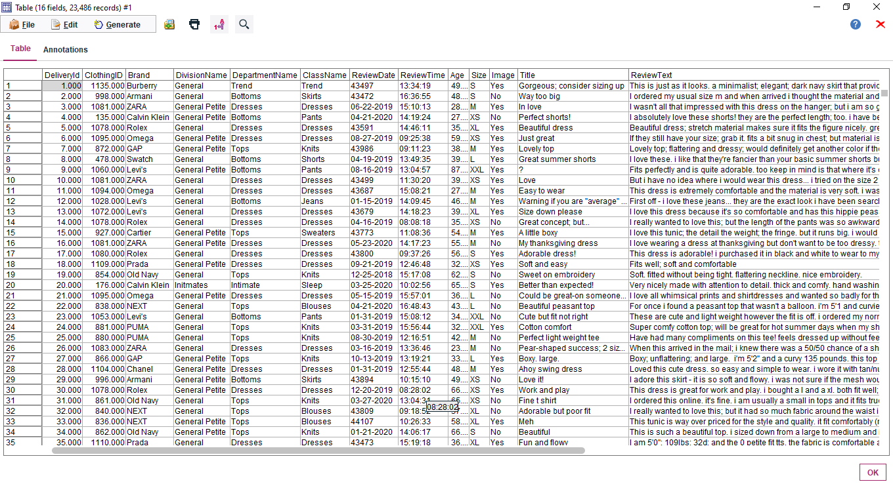
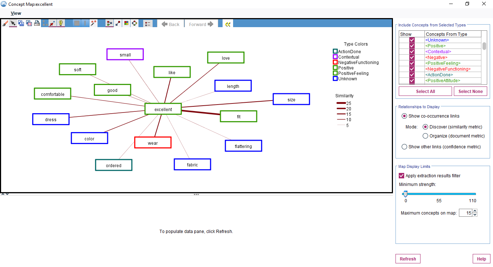
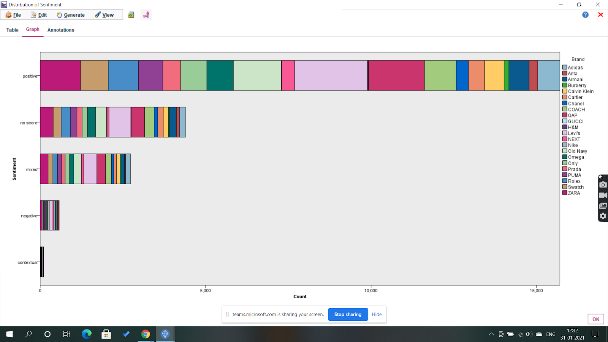
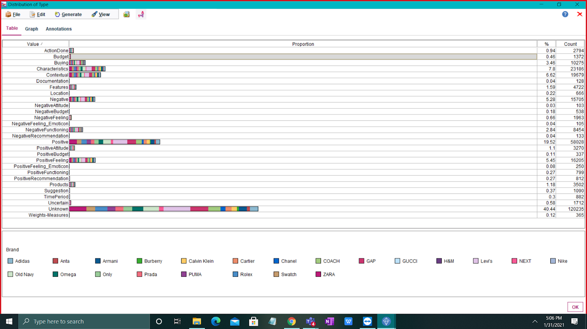

# Sentimental Analysis on Womens Clothing Dataset using IBM SS Modeler

### IBM SPSS Modeler :
* SPSS Modeler is a functionally complete version that you install and run on your personal computer. 
* With SPSS Modeler, we can build accurate predictive models quickly, without programming.
* Using the unique visual interface, you can easily visualize the data mining process.

### Dataset: 
Womens Clothing E-Commerce Reviews

### This dataset includes 23486 rows and 10 feature variables. Each row corresponds to a customer review, and includes the variables:
* Delivery ID: Integer Categorical variable that refers to the specific piece purchased.
* Clothing ID: Integer Categorical variable that refers to the specific piece being reviewed.
* Brand: Categorical name of the product brand name.
* Age: Positive Integer variable of the reviewers age.
* Size: Categorical name of the product size.
* Image: Categorical name yes/no for image posted.
* Title: String variable for the title of the review.
* Review Text: String variable for the review body.
* Rating: Positive Ordinal Integer variable for the product score granted by the customer from 1 Worst, to 5 Best.
* Positive Feedback Count: Positive Integer documenting the number of other customers who found this review positive.
* Division Name: Categorical name of the product high level division.
* Department Name: Categorical name of the product department name.
* Class Name: Categorical name of the product class name.

### Most used words in the reviews: 

### Brand wise negative and positive text classification: 
)

### Type of words used brand wise

